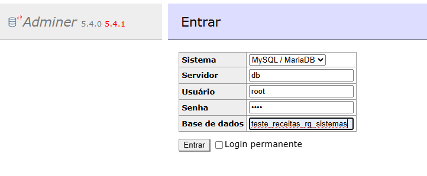
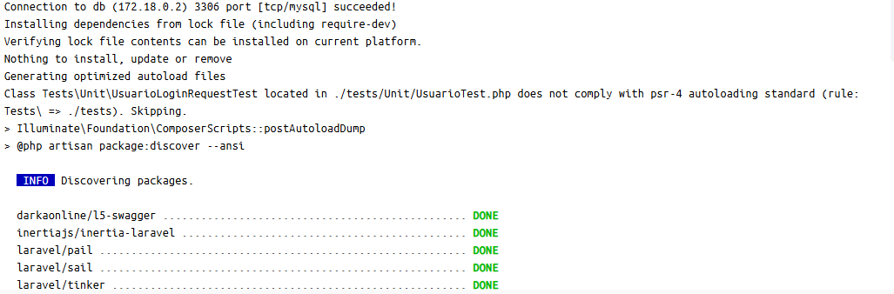
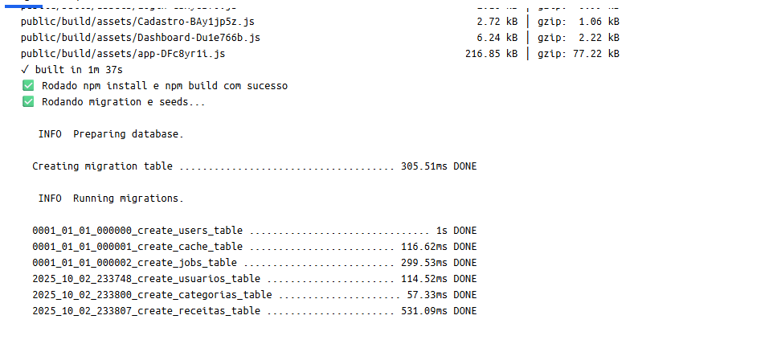
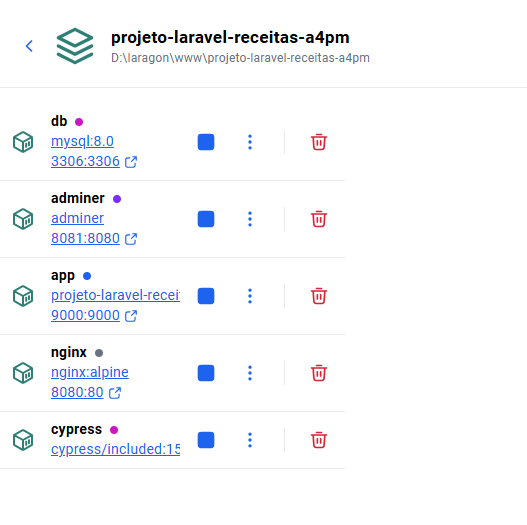
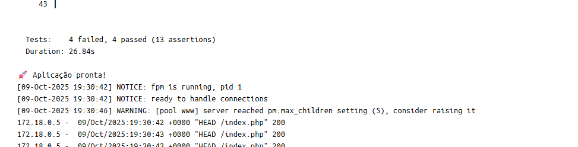
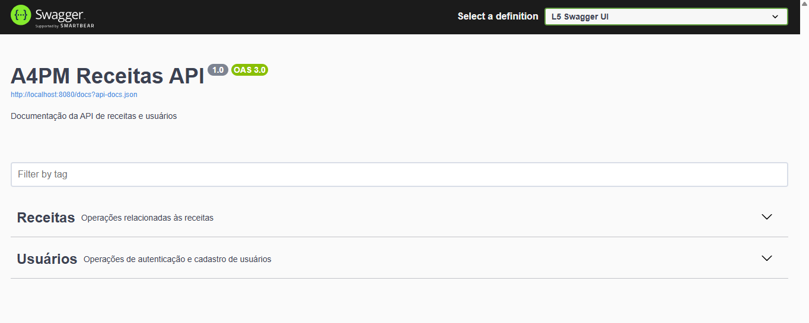
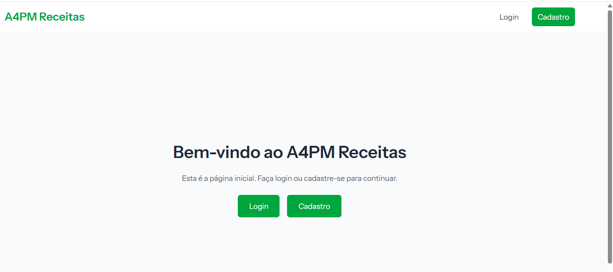
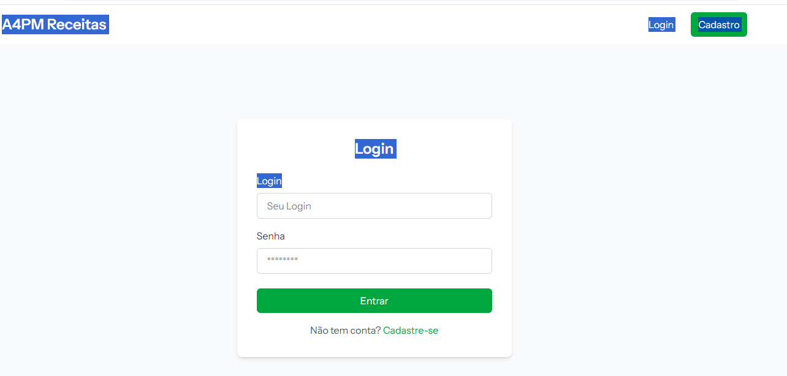
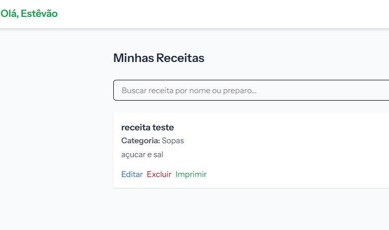

# 🍲 Sistema de Receitas Para Teste Tecnico da A4PM

Sistema de cadastro e gerenciamento de receitas culinárias, desenvolvido com Laravel 12, Vue.js, Docker e Cypress para testes automatizados, visando o teste tecnico para A4PM.

---

## 📌 Funcionalidades

- **Login e Cadastro de Usuários**
- **CRUD completo de Receitas (Cadastro, edição, atualização e remoção)**

---

## Estrutura do projeto

- O frontend Vue está localizado em` resources/js/`
- O backend Laravel segue a estrutura padrão em `app/`
- Os testes Cypress estão em `cypress/e2e/`
- O Nginx serve o app na porta 8080
- O banco MySQL roda na porta 3306 e pode ser acessado via Adminer em `http://localhost:8081`
- Caso alguem sql não rode automaticamente via docker, deixei o arquivo `script.sql` na raiz do projeto
  - Categorias por exemplo

---

## 🚀 Tecnologias Utilizadas

* **Vue 3 integrado ao Laravel**
* **Laravel 12**
* **PHPUnit, do proprio Laravel**
* **Cypress 15**

---

### 🧰 Requisitos

* Docker Desktop instalado
* Git

Nenhuma instalação local de PHP, MySQL ou Node.js é necessária — tudo roda em containers.

---

## 📦 Instalação

### 1. Instalar o Docker Desktop e abri-lo
```bash
https://docs.docker.com/get-started/
```

### 2. Clonar o projeto

```bash
https://github.com/estevaotl/projeto-laravel-receitas-a4pm.git
cd projeto-laravel-receitas-a4pm
```

### 3. Deploy do Projeto

> Copie o .env.example para um arquivo chamado .env --- Não precisava editar nada. Só deixar como está

> No terminal, execute o comando abaixo:

```bash
docker-compose up --build
```

---

## 🌐 Acesso ao Projeto

* **Projeto Principal :** [http://localhost:8080](http://localhost:8080)
* **Swagger :** [http://localhost:8080/api/documentation](http://localhost:8080/api/documentation)
* **Banco de Dados (Adminer):** [http://localhost:8081/?server=db&username=root](http://localhost:8081/?server=db&username=root)

---

## Acesso ao banco de dados

> Ao acessar via http://localhost:8081/?server=db&username=root, deve ficar conforme imagem abaixo. A senha é 'root', sem as aspas.


--- 

## 🌐 Executando os testes Cypress (Não consegui automatizar via comando no Docker)

```bash
# Rodar os testes automaticamente
npx cypress open
```

⚠️ O Cypress depende do Nginx estar ativo. Certifique-se de que o projeto está rodando antes de executar os testes.

---

## Imagens do projeto no docker










--- 

## 👨‍💻 Autor

- Desenvolvido por **Estêvão Leite**
- 📧 Email: [estevaotlnf@gmail.com](mailto:estevaotlnf@gmail.com)
- 🔗 [LinkedIn](https://linkedin.com/in/estevao-leite)

---

## 📄 Licença

- Este projeto está sob a licença MIT.
- Sinta-se livre para usar, modificar e contribuir.
